# Netflix Landing Page clone

Based on Tutorial ["Build a Netflix Landing Page Clone with HTML, CSS &amp; JS"](https://www.youtube.com/watch?v=P7t13SGytRk) from Traversy Media&trade;.

The icons are from the Font Awesome&trade; [https://fontawesome.com/](https://fontawesome.com/) library.

# Disclaimer

I coded this website template only for the purpose of learning. **All the credits go to Traversy Media&trade;.**

- Traversy Media&trade; youtube channel: [https://www.youtube.com/channel/UC29ju8bIPH5as8OGnQzwJyA](https://www.youtube.com/channel/UC29ju8bIPH5as8OGnQzwJyA)

- Traversy Media&trade; site: [https://www.traversymedia.com/](https://www.traversymedia.com/)

- Font Awesome&trade; site: [https://fontawesome.com/](https://fontawesome.com/)

## How to Install and Run

**1. Check if you have a recent version of [Node.js](https://nodejs.org/) (which comes bundled with [npm](https://www.npmjs.com/), a JavaScript package manager):**

```bash
$ node -v
```

```bash
$ npm -v
```

**2. In the _project root directory_ install all the dependencies and libs:**

```bash
$ npm install
```

**3. Start the webpack-dev-server:**

```bash
$ npm run start
```

**4. Access [http://localhost:8080/](http://localhost:8080/) on your browser.**

# License

Please see the [license
agreement](https://github.com/julianomacielferreira/netflix-lp/blob/master/LICENSE).

# Screenshots

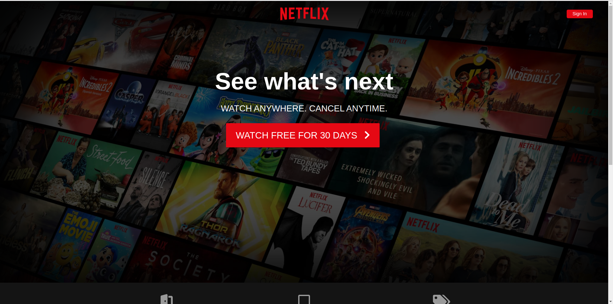
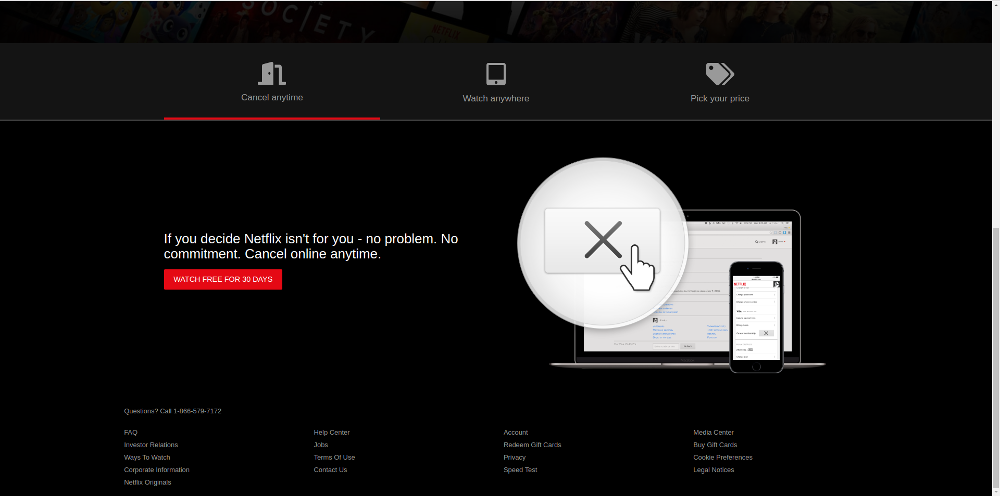
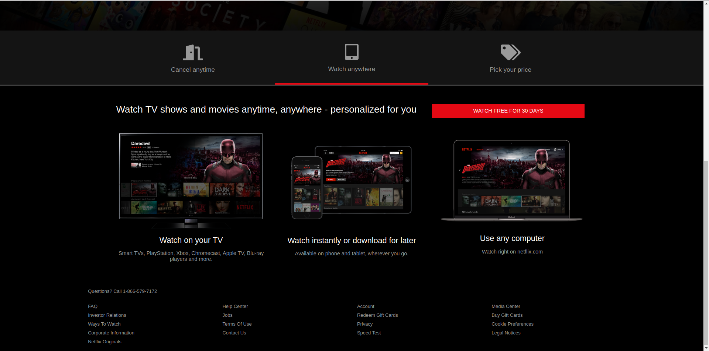
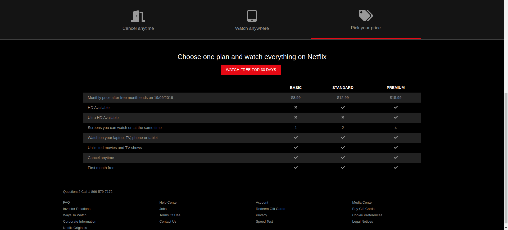
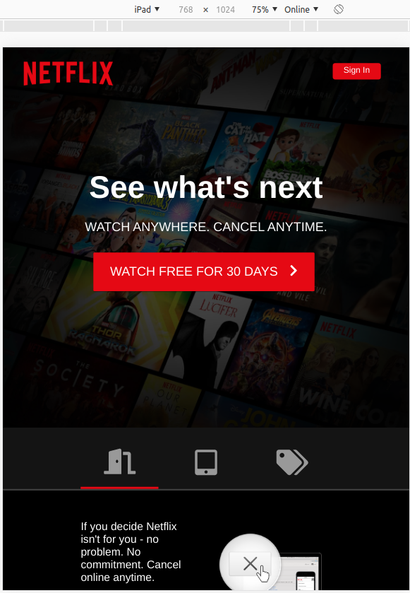
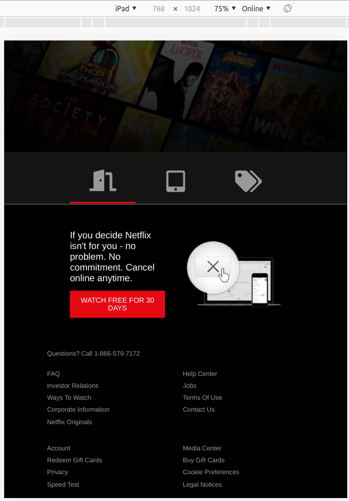
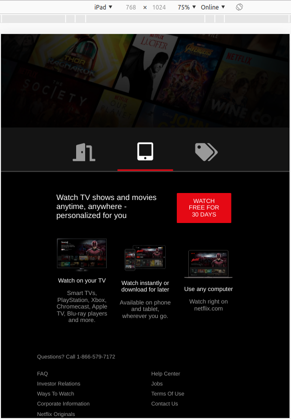
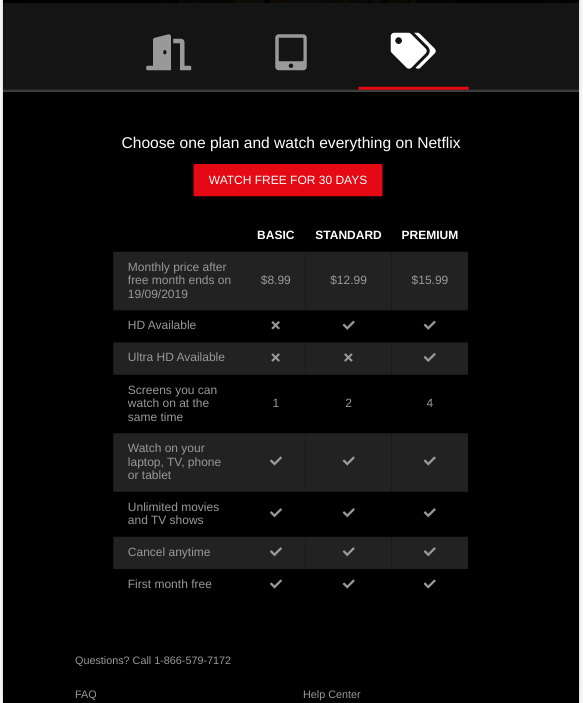
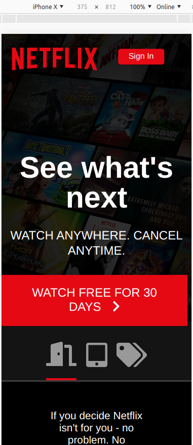
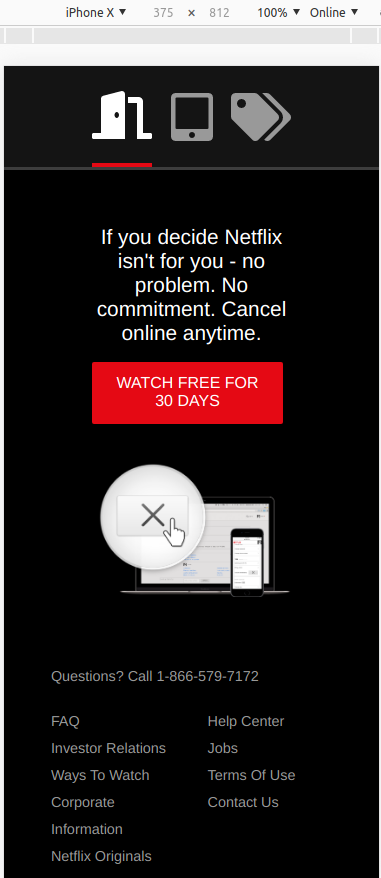

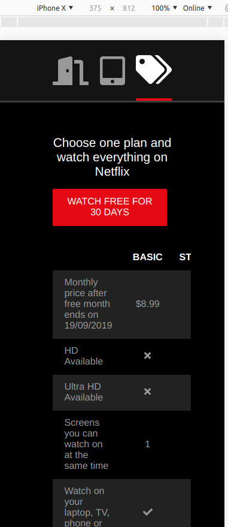
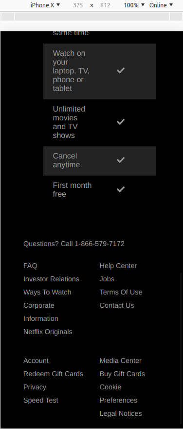
